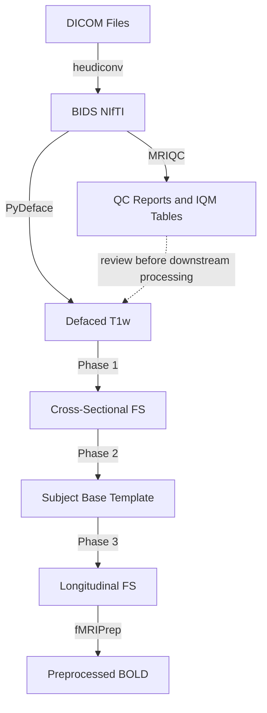

# R01 Preprocessing Workflow

This repository contains scripts for preprocessing neuroimaging data from DICOM format through BIDS conversion, MRIQC quality control, defacing, FreeSurfer reconstruction (longitudinal stream), and fMRIPrep. The workflow checks raw BIDS quality early, then ensures all anatomical derivatives remain defaced and anatomically consistent across timepoints.

## Overview

The preprocessing pipeline consists of five main steps:

1. **DICOM to NIfTI (BIDS format)** – Convert DICOMs to BIDS NIfTI using heudiconv
2. **MRIQC** – Generate anatomical and functional image quality metrics from BIDS NIfTI
3. **PyDeface** – Deface T1w images for privacy compliance
4. **FreeSurfer Longitudinal Stream** – A three-phase process (Cross-sectional, Base, Longitudinal) to optimize multi-session data
5. **fMRIPrep** – Preprocessing using pre-computed longitudinal FreeSurfer derivatives

FreeSurfer and fMRIPrep can run in either anatomical input mode:

- `ANAT_MODE=defaced` (default): use `*_desc-defaced_T1w.nii.gz`, write FreeSurfer outputs to `derivatives/freesurfer`, and write fMRIPrep outputs to `derivatives/fmriprep`
- `ANAT_MODE=original`: use the original `*_T1w.nii.gz`, write FreeSurfer outputs to `derivatives/freesurfer_original`, and write fMRIPrep outputs to `derivatives/fmriprep_original`

## Directory Structure

```
/gscratch/scrubbed/fanglab/xiaoqian/IFOCUS/
├── sourcedata/
│   ├── dicom/          # Raw DICOM files
│   └── nii/            # BIDS NIfTI (sub-*/ses-*/)
└── derivatives/
    ├── mriqc/         
    │   ├── sub-*.html # MRIQC participant-level visual reports
    │   ├── QC_anat.csv
    │   ├── QC_func.csv
    │   └── sum.json
    ├── mriqc_work/    # Isolated MRIQC work directories by subject
    ├── freesurfer/     
    │   ├── sub-01_ses-01/               # Phase 1: Cross-sectional
    │   ├── sub-01_base/                 # Phase 2: Subject Template
    │   └── sub-01_ses-01.long.sub-01_base/ # Phase 3: Final Longitudinal
    ├── freesurfer_original/ # Optional non-defaced FreeSurfer outputs
    ├── fmriprep/       # fMRIPrep outputs using defaced anatomy
    └── fmriprep_original/ # Optional fMRIPrep outputs using original anatomy
```

## Workflow Steps

### Step 0: Download Recent DICOM Sessions from Flywheel

Download raw DICOM sessions from Flywheel by session scan date on Hyak.

**Script:** `download_bids_subjects_on_hyak_byTime.sh`

**Usage:**
```bash
# Set your Flywheel API key for the current shell session.
# The SDK expects host:key format.
export FW_KEY="uw-chn.flywheel.io:YOUR_API_KEY"

# Or, if you only copied the token portion:
export FW_HOST="uw-chn.flywheel.io"
export FW_KEY="YOUR_API_KEY"

# Preview sessions with session.timestamp on or after START_DATE.
# This writes a manifest only; no data are downloaded.
START_DATE=2026-06-22 LIST_ONLY=1 bash download_bids_subjects_on_hyak_byTime.sh

# Download DICOM files into <subject>/<session>/<acquisition>/ folders.
START_DATE=2026-06-22 LIST_ONLY=0 bash download_bids_subjects_on_hyak_byTime.sh
```

Run the download step from an interactive compute allocation or batch job, not a login node, because long downloads can be killed on `klone-login*`.

**What it does:**
- Finds sessions in `fang-lab/IFOCUS` with `session.timestamp >= START_DATE`
- Writes a manifest such as `/gscratch/fang/IFOCUS/sourcedata/MRI/sessions_since_2026-06-22.csv`
- Downloads DICOM files into `/gscratch/fang/IFOCUS/sourcedata/MRI/<subject>/<session>/<acquisition>/`
- Reuses existing files only when the file size matches Flywheel metadata

**Common options:**
```bash
# Use the older fw download tar workflow. This may be killed by Hyak/Apptainer.
DOWNLOAD_MODE=tar EXTRACT_AFTER=1 KEEP_TARS=1 LIST_ONLY=0 bash download_bids_subjects_on_hyak_byTime.sh

# Change parallel download count. Default is JOBS=1 because Hyak may kill
# multiple concurrent fw download processes inside Apptainer.
JOBS=2 LIST_ONLY=0 bash download_bids_subjects_on_hyak_byTime.sh

# Try explicit CLI login before downloads, only if fw download reports an auth error
RUN_FW_LOGIN=1 LIST_ONLY=0 bash download_bids_subjects_on_hyak_byTime.sh

# Change Flywheel project or destination if needed
PROJECT_PATH="fang-lab/IFOCUS" BIND_SRC="/gscratch/fang/IFOCUS/sourcedata/MRI" bash download_bids_subjects_on_hyak_byTime.sh
```

**Notes:**
- `fw sync --include` filters file types, not dates. This script queries sessions by date first, then downloads the matched sessions.
- If the Apptainer image does not include the Flywheel Python SDK, the script installs an isolated `flywheel-sdk` copy under `/DATA_DIR/.flywheel-sdk-python`.
- The default `DOWNLOAD_MODE=files` avoids `fw download` because the CLI tar workflow can be killed by Hyak/Apptainer.
- File downloads are run as short per-file Python SDK processes, so reruns skip completed files and retry killed partial files.
- `DOWNLOAD_MODE=tar` skips `fw login` by default because that step can be killed by Hyak/Apptainer squashfuse cleanup; set `RUN_FW_LOGIN=1` only if tar downloads fail with an authentication error.
- Do not commit or paste real Flywheel API keys into scripts or documentation.

### Step 1: DICOM to BIDS Conversion

Convert raw DICOM files to BIDS-compliant NIfTI format using heudiconv.

If Flywheel downloads DICOM packages as `*.dicom.zip` files, unzip them before
running heudiconv:

```bash
bash unzip.sh
```

The unzip step extracts each `*.dicom.zip` file into the same acquisition
directory and keeps the original zip file. The conversion job expects extracted
DICOM files under each subject/session directory.

**Script:** `submit_dicom_to_nii.sh` (wraps `heudiconv_job.sbatch`)

**Usage:**
```bash
# First unzip Flywheel DICOM packages, if present
bash unzip.sh

# Process all subjects
./submit_dicom_to_nii.sh

# Process specific subject (manual submission)
sbatch --export=ALL,TARGET_SUB="sub-001" heudiconv_job.sbatch

# Process specific subject and session (manual submission)
sbatch --export=ALL,TARGET_SUB="sub-001",TARGET_SES="ses-01" heudiconv_job.sbatch
```

**What it does:**
- Scans the DICOM directory for all subjects
- Submits a job array (one job per subject)
- Stages each session's files into `$SLURM_TMPDIR` as neutral `*.dcm` symlinks before conversion
- Uses `heuristic_reproin_like.py` for BIDS conversion
- Outputs to `sourcedata/nii/` in BIDS format

**Note:** The wrapper script `submit_dicom_to_nii.sh` processes all subjects. For specific subjects/sessions, submit `heudiconv_job.sbatch` directly with `--export` flags.

**Configuration:**
- DICOM root: `/gscratch/scrubbed/fanglab/xiaoqian/IFOCUS/sourcedata/dicom`
- Heuristic: `heuristic_reproin_like.py`

### Step 2: MRIQC Quality Control

Run MRIQC on the BIDS NIfTI data before defacing and downstream preprocessing. This provides participant-level anatomical and functional QC reports and summary CSV files that can be reviewed before investing cluster time in FreeSurfer and fMRIPrep.

**Scripts:** `re_submit_mriqc.sh` (wraps `mriqc_job.sh`) and `run_qc_parser.sh` (wraps `generate_QCsheets.py`)

**Usage:**
```bash
# Process all subjects
./re_submit_mriqc.sh

# Process one or more specific subjects
./re_submit_mriqc.sh sub-001 sub-002

# After MRIQC jobs finish, summarize IQMs into CSV/JSON reports
sbatch run_qc_parser.sh
```

**What it does:**
- Runs MRIQC 24.0.2 from `/gscratch/fang/images/mriqc_24.0.2.sif`
- Scans BIDS input from `/gscratch/scrubbed/fanglab/xiaoqian/IFOCUS/sourcedata/nii`
- Writes participant reports and MRIQC outputs to `/gscratch/scrubbed/fanglab/xiaoqian/IFOCUS/derivatives/mriqc`
- Uses isolated per-subject work directories under `/gscratch/scrubbed/fanglab/xiaoqian/IFOCUS/derivatives/mriqc_work/sub-XXX` to avoid multi-job work-directory conflicts
- Runs with `--fd_thres 0.3`, `--verbose-reports`, and `--no-sub`
- Parses generated HTML reports into `QC_anat.csv`, `QC_func.csv`, and `sum.json`

**Review outputs:**
```bash
ls /gscratch/scrubbed/fanglab/xiaoqian/IFOCUS/derivatives/mriqc
cat /gscratch/scrubbed/fanglab/xiaoqian/IFOCUS/derivatives/mriqc/sum.json
```

To submit only sessions listed in the CSV generated by `download_bids_subjects_on_hyak_byTime.sh`:

```bash
# Preview first, then submit (filenames resolve under sourcedata/dicom).
bash submit_mriqc.sh --csv sessions_all_since_2026-06-22.csv --dry-run
bash submit_mriqc.sh --csv sessions_all_since_2026-06-22.csv

# Without a CSV, submit all subjects as an array.
bash submit_mriqc.sh
```

CSV filenames resolve under `/gscratch/scrubbed/fanglab/xiaoqian/IFOCUS/sourcedata/dicom`; absolute paths are also accepted. CSV mode requires `python3`, reads `subject_label` and `session_label`, accepts labels with or without `sub-`/`ses-` prefixes, and removes duplicate subject/session pairs. It validates all selected BIDS session directories before submitting; empty manifests, invalid labels, or missing directories stop submission. Each pair gets one job with MRIQC's `--session-id` filter and a separate session work directory. `DATA_DIR` can override the default BIDS NIfTI directory. Use `re_submit_mriqc.sh` for explicit subject lists.

### Step 3: PyDeface

Deface T1w anatomical images to remove facial features for privacy compliance.

**Script:** `submit_pydeface.sh` (wraps `pydeface.sbatch`)

**Usage:**
```bash
# Process all subjects
./submit_pydeface.sh

# Process specific subject
./submit_pydeface.sh sub-001

# Process specific subject and session
./submit_pydeface.sh sub-001 ses-01
```

**What it does:**
- Defaces T1w images in BIDS directory
- Creates `*desc-defaced_T1w.nii.gz` files
- Preserves original files (defaced versions replace them in the pipeline)

**Verification:**
```bash
./check_miss_pydefaced_sessions.sh
```

### Step 4: FreeSurfer Longitudinal Stream

For datasets with multiple sessions, use the FreeSurfer longitudinal stream to reduce anatomical noise and prevent processing bias across timepoints.

#### Phase 1: Cross-Sectional

**Script:** `submit_recon.sh` (wraps `recon_all.sbatch`)

**Usage:**
```bash
# Process all sessions with defaced T1w inputs (default)
./submit_recon.sh

# Process all sessions with original, non-defaced T1w inputs
ANAT_MODE=original ./submit_recon.sh

# Process a specific subject/session
bash submit_specific_recon.sh sub-001/ses-01

# Process all sessions for a specific subject
bash submit_specific_recon.sh sub-001

# Process specific subjects/sessions with original, non-defaced T1w inputs
ANAT_MODE=original bash submit_specific_recon.sh sub-001/ses-01
```

**What it does:**
- Processes every session independently
- Creates folders named `sub-XXX_ses-YYY`
- Uses `derivatives/freesurfer` for `ANAT_MODE=defaced` and `derivatives/freesurfer_original` for `ANAT_MODE=original`
- Performs standard `recon-all` processing

**Note:** `submit_recon.sh` processes all sessions. Use `submit_specific_recon.sh` for specific subjects or sessions. `ANAT_MODE=defaced` requires PyDeface outputs to exist first; `ANAT_MODE=original` skips that requirement.

#### Phase 2: Subject Base Template

**Script:** `submit_longitudinal.py` (Stage: BASE)

**Usage:**
```bash
# Process all subjects with defaced FreeSurfer derivatives (default)
python submit_longitudinal.py

# Process all subjects with original-anatomy FreeSurfer derivatives
ANAT_MODE=original python submit_longitudinal.py
```

**What it does:**
- Creates an unbiased, subject-specific average template from all available sessions
- Creates `sub-XXX_base` folders
- Reads cross-sectional folders from the anatomy-mode-specific FreeSurfer directory
- Automatically submits LONG jobs with dependencies after BASE completes

**Note:** This script processes all subjects automatically. For specific subjects, you can modify the script or submit `long_stage.sbatch` directly:
```bash
# Manual BASE submission for specific subject
sbatch --export=ALL,STAGE=BASE,SUBID="sub-001",TPS="-tp sub-001_ses-01 -tp sub-001_ses-02" long_stage.sbatch

# Manual BASE submission using original, non-defaced anatomy
sbatch --export=ALL,ANAT_MODE=original,STAGE=BASE,SUBID="sub-001",TPS="-tp sub-001_ses-01 -tp sub-001_ses-02" long_stage.sbatch
```

#### Phase 3: Longitudinal Run

**Script:** `submit_longitudinal.py` (Stage: LONG)

**Usage:**
```bash
# Process all subjects (automatically submitted after BASE)
python submit_longitudinal.py

# Process original-anatomy FreeSurfer longitudinal outputs
ANAT_MODE=original python submit_longitudinal.py
```

**What it does:**
- Re-processes each session using the Base template as a seed
- Produces the final derivatives for analysis
- Folders are named `sub-XXX_ses-YYY.long.sub-XXX_base`
- Jobs are automatically submitted with `--dependency=afterok` on the BASE job

**Note:** For specific sessions, submit `long_stage.sbatch` directly:
```bash
# Manual LONG submission for specific session (after BASE completes)
sbatch --dependency=afterok:JOBID --export=ALL,STAGE=LONG,SUBID="sub-001",TP="sub-001_ses-01" long_stage.sbatch

# Manual LONG submission using original, non-defaced anatomy
sbatch --dependency=afterok:JOBID --export=ALL,ANAT_MODE=original,STAGE=LONG,SUBID="sub-001",TP="sub-001_ses-01" long_stage.sbatch
```

**Verification:**
```bash
# Check defaced FreeSurfer outputs
./check_freesurfer_status.sh

# Check original-anatomy FreeSurfer outputs
ANAT_MODE=original ./check_freesurfer_status.sh
```
This script generates `freesurfer_longitudinal_status_defaced.csv` or `freesurfer_longitudinal_status_original.csv` with status for all three phases (CROSS, BASE, LONG).

### Step 5: fMRIPrep Preprocessing

Run fMRIPrep using the Phase 3 Longitudinal derivatives.

**Script:** `submit_fmriprep.sh` (wraps `fmriprep.sbatch`)

**Usage:**
```bash
# Process all sessions with defaced anatomy (default)
./submit_fmriprep.sh

# Process all sessions with original, non-defaced anatomy
ANAT_MODE=original ./submit_fmriprep.sh

# Process specific session (manual submission)
# First, find the array index for your session, then:
sbatch --array=INDEX fmriprep.sbatch

# Manual specific-session submission using original, non-defaced anatomy
sbatch --array=INDEX --export=ALL,ANAT_MODE=original fmriprep.sbatch
```

**What it does:**
- Submits a job array for every session (rather than every subject)
- Uses `--fs-subject-id` to point fMRIPrep specifically to the corresponding `.long` folder in the FreeSurfer directory
- Uses a per-job BIDS filter file so `ANAT_MODE=defaced` selects `desc-defaced_T1w` and `ANAT_MODE=original` selects the plain original `T1w`
- Writes original-anatomy outputs to `derivatives/fmriprep_original` so they do not overwrite defaced-anatomy outputs
- Ensures anatomical consistency across sessions for functional alignment

**Note:** `submit_fmriprep.sh` processes all sessions. For specific sessions, you need to:
1. Find the session's array index by checking the sorted session list
2. Submit `fmriprep.sbatch` directly with `--array=INDEX`

**Verification:**
```bash
# Check defaced-anatomy fMRIPrep outputs
./check_fmriprep_status.sh

# Check original-anatomy fMRIPrep outputs
ANAT_MODE=original ./check_fmriprep_status.sh
```
This script generates `fmriprep_status_report_defaced.csv` or `fmriprep_status_report_original.csv` with completion status.

**Critical Note:** This step must only be run after Phase 3 of FreeSurfer is complete for the target session in the same `ANAT_MODE`.

## Workflow Summary



## Specific Subject/Session Processing

Many scripts support processing specific subjects or sessions. Here's a summary:

| Script | Specific Sub/Ses Support | Method |
|--------|-------------------------|--------|
| `submit_dicom_to_nii.sh` | ⚠️ Manual only | Submit `heudiconv_job.sbatch` directly with `--export=ALL,TARGET_SUB="sub-XXX"` |
| `re_submit_mriqc.sh` | ✅ Yes | `./re_submit_mriqc.sh sub-001` or `./re_submit_mriqc.sh sub-001 sub-002` |
| `submit_mriqc.sh` | ✅ CSV sessions | `bash submit_mriqc.sh --csv sessions.csv` |
| `submit_pydeface.sh` | ✅ Yes | `./submit_pydeface.sh sub-001` or `./submit_pydeface.sh sub-001 ses-01` |
| `submit_recon.sh` | ❌ No | Use `submit_specific_recon.sh` instead; supports `ANAT_MODE=defaced` or `ANAT_MODE=original` |
| `submit_specific_recon.sh` | ✅ Yes | `ANAT_MODE=original bash submit_specific_recon.sh sub-001/ses-01` |
| `submit_longitudinal.py` | ⚠️ Manual only | Submit `long_stage.sbatch` directly with appropriate `--export` flags; supports `ANAT_MODE=defaced` or `ANAT_MODE=original` |
| `submit_fmriprep.sh` | ⚠️ Manual only | Submit `fmriprep.sbatch` directly with `--array=INDEX`; supports `ANAT_MODE=defaced` or `ANAT_MODE=original` |

## Utility Scripts

### Status Checking

- **`check_freesurfer_status.sh`** – Check FreeSurfer processing status for all phases
  - Outputs: `freesurfer_longitudinal_status_defaced.csv` or `freesurfer_longitudinal_status_original.csv`
  - Checks for lock files, log completion, and required output files

- **`check_fmriprep_status.sh`** – Check fMRIPrep completion status
  - Outputs: `fmriprep_status_report_defaced.csv` or `fmriprep_status_report_original.csv`
  - Verifies HTML reports, anatomical, functional, and confound outputs

- **`check_miss_pydefaced_sessions.sh`** – List all defaced sessions
  - Shows which subject/session combinations have been defaced

- **`check_error.sh`** – Check for errors in log files (if available)

- **`run_qc_parser.sh`** – Parse MRIQC HTML reports into aggregate QC files
  - Outputs: `derivatives/mriqc/QC_anat.csv`, `derivatives/mriqc/QC_func.csv`, and `derivatives/mriqc/sum.json`

### Data Management

- **`fix_intended_for.py`** – Fix `IntendedFor` fields in JSON sidecars (if needed)

- **`verify_freesurfer.sh`** – Additional FreeSurfer verification (if available)

- **`unzip.sh`** – Extract Flywheel `*.dicom.zip` files before DICOM-to-NIfTI conversion

## Troubleshooting

### Longitudinal Specifics

- **Dependency Issues:** The `submit_longitudinal.py` script uses Slurm dependencies. If the BASE job fails, the LONG jobs will be cancelled automatically.

- **Naming Mismatches:** fMRIPrep requires the `--fs-subject-id` to match the folder name in your FreeSurfer directory exactly. If fMRIPrep fails to find anatomy, check the `FS_LONG_ID` variable in `fmriprep.sbatch`.

- **Anatomy Mode Mismatches:** Use the same `ANAT_MODE` for cross-sectional FreeSurfer, longitudinal FreeSurfer, fMRIPrep, and status checks. For example, `ANAT_MODE=original` fMRIPrep expects longitudinal FreeSurfer outputs under `derivatives/freesurfer_original`.

- **fsaverage:** If fsaverage is missing from the derivatives folder, the status script will alert you. fMRIPrep or FreeSurfer usually populates this automatically.

### General Cluster Notes

- **Memory:** fMRIPrep is memory-intensive. The script is configured for 48GB; increase to 64GB if processing high-resolution data or many sessions simultaneously.

- **Work Directory:** The `work_fmriprep` directory grows rapidly. Clean up work directories once subjects are verified.

- **Log Files:** Refer to the log files in the `logs/` directory for detailed error messages.

## Configuration

All scripts use hardcoded paths. Update the following variables in each script as needed:

- **BIDS_ROOT:** `/gscratch/scrubbed/fanglab/xiaoqian/IFOCUS/sourcedata/nii`
- **DICOM_ROOT:** `/gscratch/scrubbed/fanglab/xiaoqian/IFOCUS/sourcedata/dicom`
- **DERIVS_DIR:** `/gscratch/scrubbed/fanglab/xiaoqian/IFOCUS/derivatives/`
- **MRIQC output:** `/gscratch/scrubbed/fanglab/xiaoqian/IFOCUS/derivatives/mriqc`
- **MRIQC work:** `/gscratch/scrubbed/fanglab/xiaoqian/IFOCUS/derivatives/mriqc_work`
- **Defaced FreeSurfer output:** `/gscratch/scrubbed/fanglab/xiaoqian/IFOCUS/derivatives/freesurfer`
- **Original-anatomy FreeSurfer output:** `/gscratch/scrubbed/fanglab/xiaoqian/IFOCUS/derivatives/freesurfer_original`
- **Defaced-anatomy fMRIPrep output:** `/gscratch/scrubbed/fanglab/xiaoqian/IFOCUS/derivatives/fmriprep`
- **Original-anatomy fMRIPrep output:** `/gscratch/scrubbed/fanglab/xiaoqian/IFOCUS/derivatives/fmriprep_original`
- **Flywheel download root:** `/gscratch/fang/IFOCUS/sourcedata/MRI`

## Script Files

### Main Workflow Scripts
- `download_bids_subjects_on_hyak_byTime.sh` – Download Flywheel DICOM sessions by session date
- `submit_dicom_to_nii.sh` – DICOM to BIDS conversion
- `re_submit_mriqc.sh` – MRIQC submission for all subjects or specific subject lists
- `submit_mriqc.sh` – MRIQC all-subject array or CSV-selected session submission
- `submit_pydeface.sh` – Defacing
- `submit_recon.sh` – FreeSurfer cross-sectional
- `submit_specific_recon.sh` – FreeSurfer for specific subjects
- `submit_longitudinal.py` – FreeSurfer longitudinal (BASE and LONG)
- `submit_fmriprep.sh` – fMRIPrep preprocessing

### SBATCH Templates
- `heudiconv_job.sbatch` – DICOM conversion job template
- `mriqc_job.sh` – MRIQC participant-level job template
- `pydeface.sbatch` – Defacing job template
- `recon_all.sbatch` – FreeSurfer cross-sectional job template
- `long_stage.sbatch` – FreeSurfer longitudinal job template
- `fmriprep.sbatch` – fMRIPrep job template

### Configuration Files
- `heuristic_reproin_like.py` – Heudiconv heuristic for BIDS conversion
- `pydeface.def` – PyDeface configuration

### Utility Scripts
- `check_freesurfer_status.sh` – FreeSurfer status checker
- `check_fmriprep_status.sh` – fMRIPrep status checker
- `check_miss_pydefaced_sessions.sh` – Defacing status checker
- `check_error.sh` – Error log checker
- `fix_intended_for.py` – Fix JSON sidecars
- `generate_QCsheets.py` – Parse MRIQC HTML reports into QC CSV/JSON summaries
- `run_qc_parser.sh` – Slurm wrapper for MRIQC summary generation
- `verify_freesurfer.sh` – FreeSurfer verification
- `unzip.sh` – File extraction utility
